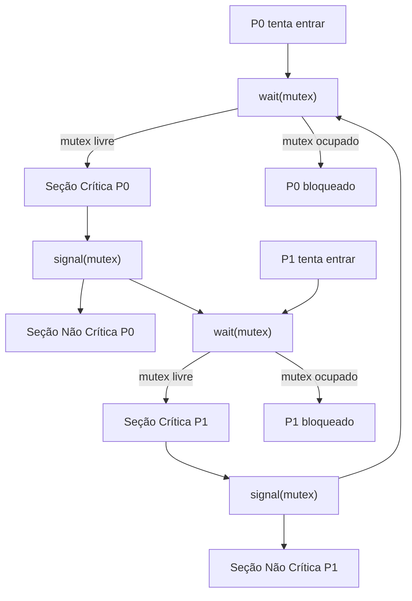
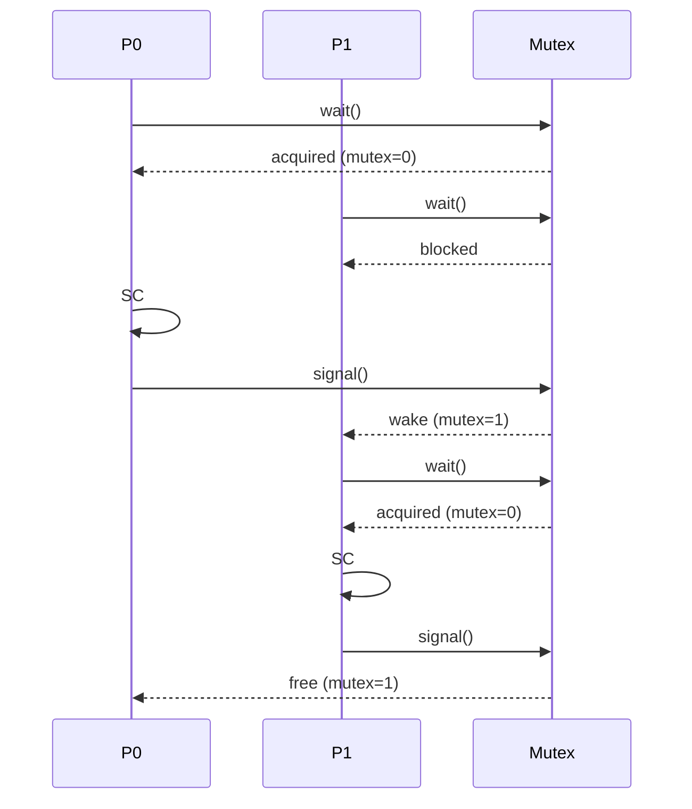
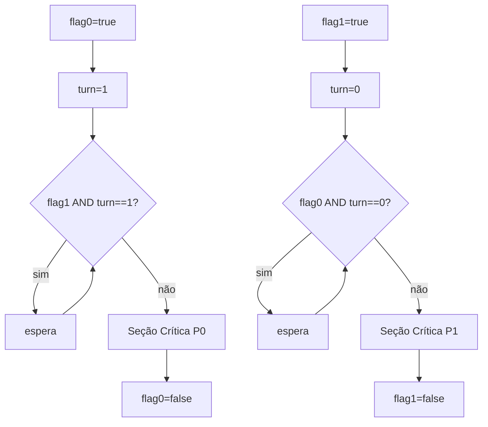
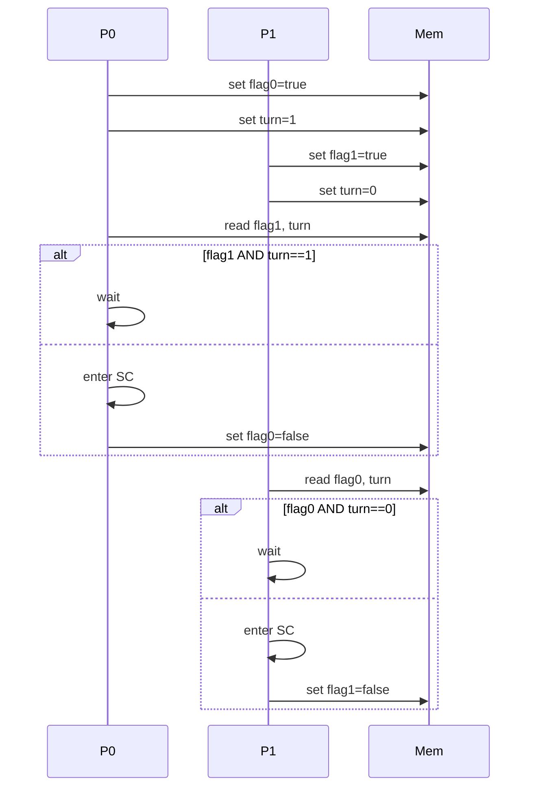

# S1 — Simulação Manual de Concorrência (Dijkstra e Peterson)

## Escopo
- Dois processos: `P0` e `P1`.
- Objetivo: **exclusão mútua** na seção crítica (SC).
- Simulações em passos, explorando *interleavings* (intercalações) que funcionam e os que falhariam sem o protocolo correto.

## Premissas
- Operações `sleep` representam atrasos que mudam a ordem de execução.
- Variáveis e primitivas são atômicas apenas quando indicado (ex.: `wait`/`signal`).

## Seção 1 — Dijkstra (Semáforo Binário)
- **Estrutura:** `mutex` inicializado com 1. Cada processo executa:
  - `wait(mutex)`; SC; `signal(mutex)`.

- **Cenário A (funciona):** interleaving com bloqueio correto
  - t0: `P0` chama `wait(mutex)`, `mutex=0`, entra na SC.
  - t1: `P1` chama `wait(mutex)`, bloqueia (fila do semáforo).
  - t2: `P0` sai da SC e chama `signal(mutex)`, `mutex=1`.
  - t3: `P1` é despertado, `wait(mutex)` completa, entra na SC.
  - **Resultado:** nunca há dupla entrada; exclusão mútua garantida.

- **Cenário B (falharia sem semáforo):** checagem não atômica
  - t0: `P0` verifica `mutex==1` (check separado de set), atraso.
  - t1: `P1` verifica `mutex==1` também.
  - t2: ambos “setam” `mutex=0` quase simultaneamente.
  - t3: ambos entram na SC (violação de exclusão).
  - **Observação:** com `wait` atômico, esse interleaving não ocorre.

- **Cenário C (bug de implementação):** esquecer `signal`
  - t0: `P0` faz `wait(mutex)` e entra na SC.
  - t1: `P0` sai da SC mas esquece `signal(mutex)`.
  - t2: `P1` chama `wait(mutex)` e bloqueia indefinidamente.
  - **Resultado:** deadlock por má implementação.

- **Conclusão:** com `wait/signal` corretos, a exclusão mútua é garantida; performance e *fairness* dependem da implementação do semáforo (ordem de despertar, FIFO etc.).

## Seção 2 — Peterson (2 processos)
- **Variáveis:** `flag0`, `flag1` (boolean), `turn` (0/1).
- **Protocolo em `P0`:**
  - `flag0=true; turn=1;`
  - `while(flag1 AND turn==1) { /* espera */ }`
  - entra na SC; sai com `flag0=false;`
- **Simétrico para `P1`.**

- **Cenário A (funciona):** competição simultânea
  - t0: `P0`: `flag0=true; turn=1`.
  - t1: `P1`: `flag1=true; turn=0`.
  - t2: `P0` verifica `flag1 AND turn==1`? **Não** (`turn==0`), entra na SC.
  - t3: `P1` verifica `flag0 AND turn==0`? **Sim**, espera.
  - t4: `P0` sai, `flag0=false`.
  - t5: `P1` reavalia, `flag0==false`, entra na SC.
  - **Resultado:** exclusão garantida, alternância justa.

- **Cenário B (funciona):** um interessado, outro não
  - t0: `P0` tenta entrar (seta `flag0`, define `turn`), `P1` está com `flag1==false`.
  - t1: `P0` verifica, condição de espera falsa, entra na SC.
  - **Resultado:** sem espera desnecessária.

- **Cenário C (falharia sem `turn`):** apenas *flags*
  - Versão defeituosa: `flag0=true; while(flag1) {}` e simétrico para `P1`.
  - t0: `P0` e `P1` setam `flag=true` quase simultaneamente.
  - t1: ambos verificam `flag do outro==true` e entram em espera ocupada.
  - Possível livramento por *timing* invertido, mas sem `turn` existem interleavings em que ambos passam (visibilidade/reordenação), **ou** ficam presos (deadlock/**livelock**). O `turn` resolve o impasse de simetria.

- **Cenário D (reordenação indevida):** setar `turn` antes de `flag`
  - Se `turn` for atualizado sem o par `flag` definido, pode induzir espera extra ou justiça desigual. A ordem “seta `flag`, depois `turn`” é parte da prova de correção.

- **Conclusão:** Peterson garante exclusão mútua, progresso e **espera limitada (*bounded waiting*)** sob duas threads/processos com memória compartilhada e visibilidade adequada; cenários problemáticos surgem ao remover `turn` ou alterar a ordem das escritas.

## Diagramas (Mermaid)

### Fluxograma — Dijkstra (semáforo binário)

### Diagrama de mensagens — Dijkstra (sequência de sincronização)

### Fluxograma — Peterson (2 processos)

### Diagrama de mensagens — Peterson (memória compartilhada)

