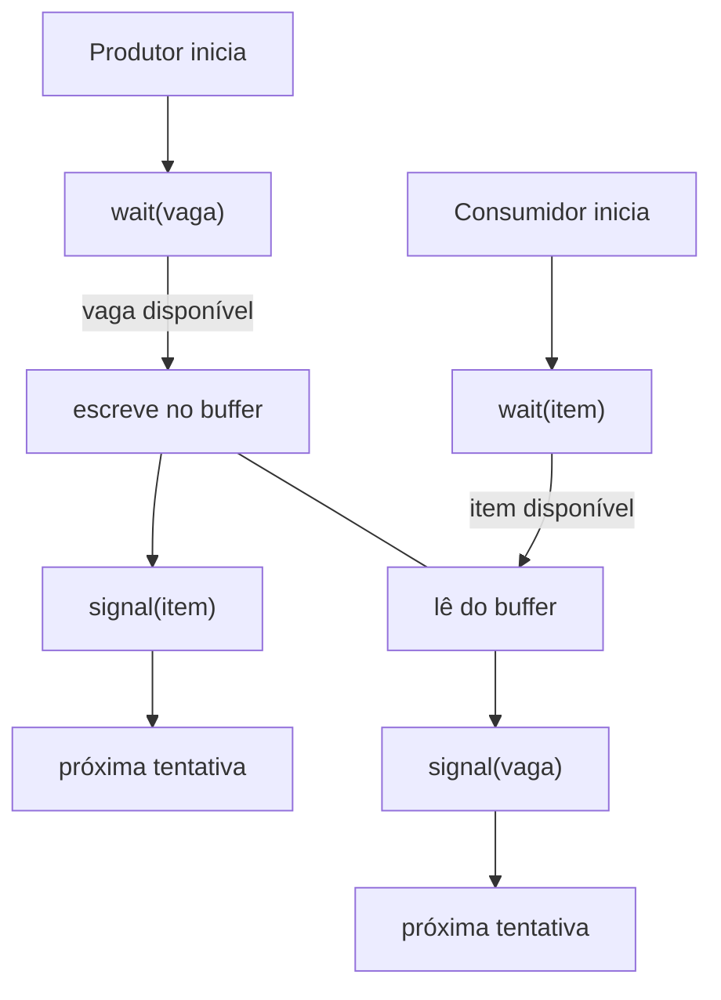
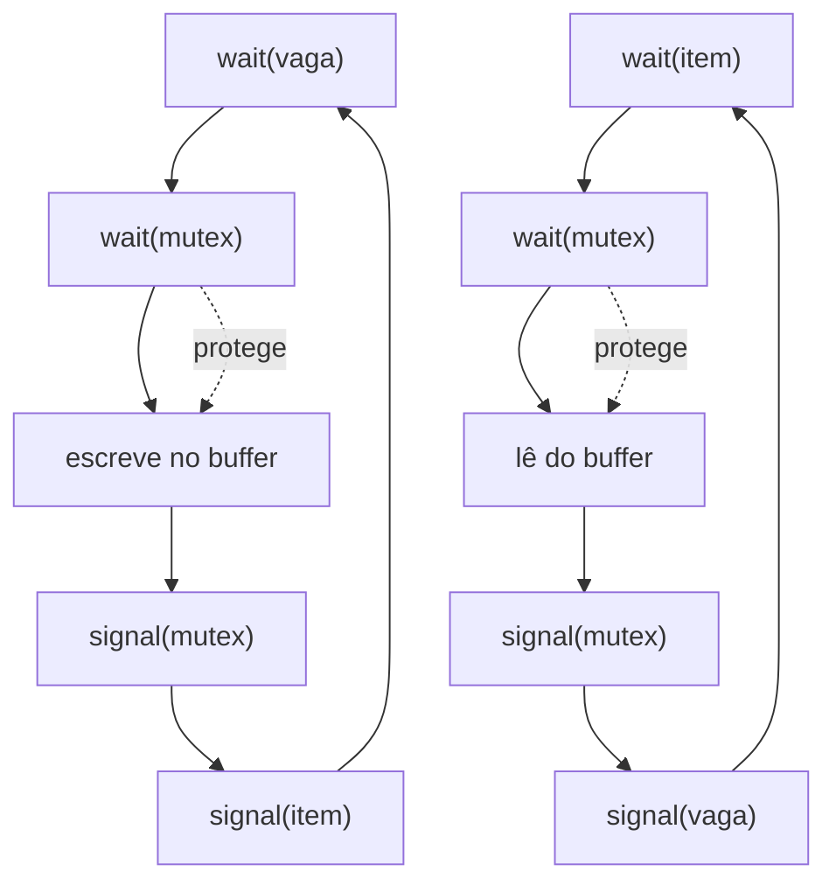
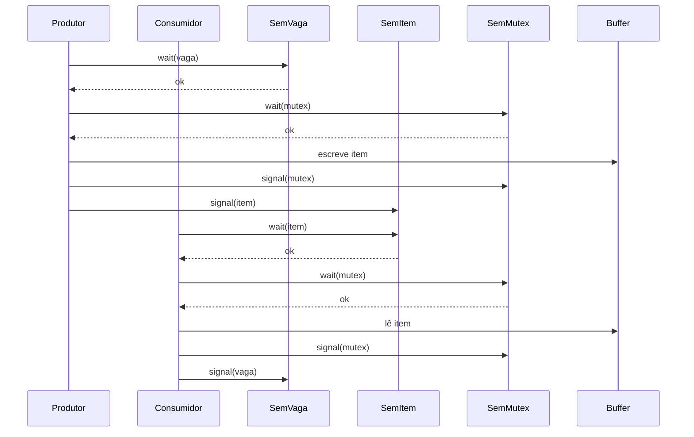

# S2 — Produtor-Consumidor com Buffer Limitado (Semáforos e Redes de Petri)

## Objetivo
- Simular manualmente (como em sala) e via Redes de Petri várias soluções do problema Produtor–Consumidor com buffer limitado.
- Cobrir: (a) sem semáforo e com sincronização sem exclusão mútua; (b) solução completa [item, vaga, mutex] com grafo de Petri e árvore de alcançabilidade; (d) simulações no JSARP para comprovar os cenários manuais.

## Parâmetros e Notação
- Buffer de tamanho `N` (usaremos `N=2` nos exemplos). 
- Contadores/semáforos conceituais:
  - `vaga` (slots livres): inicial `N`.
  - `item` (itens no buffer): inicial `0`.
  - `mutex` (exclusão mútua do buffer): inicial `1` na solução completa.
- Estados por processo: Fora | Tentando | Na SC | Saindo.
- Passos temporais: `t0`, `t1`, `t2`, ...

---

## Seção A — Simulação Manual

### 1) Sem semáforo (sem sincronização)
- **Ideia:** Produtor (P) e Consumidor (C) alteram `count` e índices do buffer sem qualquer coordenação.
- **Cenário (N=2) — overflow possível:**
  - `t0`: `count=1` (P escreve), `C` lê atrasado `count=0`.
  - `t1`: `P` incrementa (`count=2`), `C` não vê atualização e incrementa (`count=1`) — perda/violação de invariantes.
  - **Resultado:** índices/itens inconsistentes; pode escrever além do limite real.
- **Cenário — underflow possível:**
  - `t0`: `count=1` real, `P` lê `count=1` e decrementa indevidamente (bug), `C` também decrementa.
  - `t1`: `count` fica negativo; leitura em buffer vazio.
- **Observação:** Sem atomicidade e sincronização, invariantes (`0 ≤ count ≤ N`) e integridade dos índices são violados.

### 2) Com sincronização sem exclusão mútua (apenas `item` e `vaga`)
- **Ideia:** Usar semáforos de contagem para bloqueio lógico (esperar vaga/item), mas sem proteger atualizações internas do buffer (índices, ponteiros, estrutura).
- **Produtor:**
  - `wait(vaga)`; escreve no buffer; `signal(item)`.
- **Consumidor:**
  - `wait(item)`; lê do buffer; `signal(vaga)`.
- **Cenário (N=2) — condição de corrida nos índices:**
  - `t0`: `P` e `P'` (ou `P` e `C`, dependendo da estrutura) passam pelo `wait` (há tokens suficientes).
  - `t1`: Ambos atualizam `in`/`out` sem exclusão mútua; interleavings podem provocar sobrescrita/perda de itens.
- **Observação:** `item`/`vaga` preservam limites globais, mas sem `mutex` há corrupção de estrutura (índices, head/tail) pela ausência de exclusão mútua.

---

## Seção B — Solução Completa [item, vaga, mutex]

### Pseudocódigo (1 Produtor e 1 Consumidor)
- **Produtor:**
  - `wait(vaga); wait(mutex);`
  - escrever item no buffer
  - `signal(mutex); signal(item);`
- **Consumidor:**
  - `wait(item); wait(mutex);`
  - retirar item do buffer
  - `signal(mutex); signal(vaga);`

### Rede de Petri — Grafo de Lugares e Transições
- **Lugares (marcação inicial para N=2):**
  - `Vag` (vagas/lugares livres): 2 tokens
  - `Itm` (itens no buffer): 0 tokens
  - `Mtx` (exclusão mútua): 1 token
  - `P_out` (produtor fora da SC): 1 token
  - `P_in` (produtor na SC): 0 token
  - `C_out` (consumidor fora da SC): 1 token
  - `C_in` (consumidor na SC): 0 token
- **Transições:**
  - `Put` (entrada e operação do produtor na SC): 
    - Consome: `Vag(1)`, `Mtx(1)`, `P_out(1)`
    - Produz: `Itm(1)`, `Mtx(1)`, `P_in(1)`
  - `Put_done` (saída do produtor da SC):
    - Consome: `P_in(1)`
    - Produz: `P_out(1)`
  - `Get` (entrada e operação do consumidor na SC):
    - Consome: `Itm(1)`, `Mtx(1)`, `C_out(1)`
    - Produz: `Vag(1)`, `Mtx(1)`, `C_in(1)`
  - `Get_done` (saída do consumidor da SC):
    - Consome: `C_in(1)`
    - Produz: `C_out(1)`
- **Invariantes esperadas:**
  - Conservação: `Itm + Vag = N` (sempre 2)
  - Exclusão mútua: `Mtx` impede `Put` e `Get` simultâneos na SC.
  - Ocupação: Em qualquer marcação, `P_in + C_in ≤ 1` se modelarmos `Mtx` corretamente.

### Árvore de Alcançabilidade (N=2, 1P/1C)
- **Representação de marcação:** `(Itm, Vag, Mtx, P_out, P_in, C_out, C_in)`
- **Marcações iniciais e transições (resumo):**
  - `M0 = (0,2,1,1,0,1,0)`
    - Habilitadas: `Put` (há `Vag` e `Mtx`), `Get` não (sem `Itm`).
  - `M1 = fire(Put) → (1,1,1,0,1,1,0)`
    - Habilitadas: `Put_done` e `Get`.
  - `M2 = fire(Put_done) → (1,1,1,1,0,1,0)`
    - Habilitadas: `Put` e `Get`.
  - `M3 = fire(Put) → (2,0,1,0,1,1,0)`
    - Habilitadas: `Put_done` e `Get`.
  - `M4 = fire(Get) → (1,1,1,0,1,0,1)`
    - Habilitadas: `Get_done` e `Put_done`.
  - `M5 = fire(Get_done) → (1,1,1,0,1,1,0)`
  - `M6 = fire(Put_done) → (1,1,1,1,0,1,0)` (equivalente a `M2`)
- **Verificações:**
  - Nunca ocorre `P_in=1` e `C_in=1` simultaneamente com `Mtx=1` — exclusão mútua garantida.
  - `Itm+Vag=2` sempre; sem overflow/underflow.

---

## Seção D — Modelos para JSARP

### 1) Sincronização sem exclusão mútua (apenas `item` e `vaga`)
- **Lugares:** `Vag(2)`, `Itm(0)`, `P_out(1)`, `P_in(0)`, `C_out(1)`, `C_in(0)`
- **Transições:**
  - `Put_no_mutex`: consome `Vag(1)`, `P_out(1)`; produz `Itm(1)`, `P_in(1)`
  - `Put_done`: consome `P_in(1)`; produz `P_out(1)`
  - `Get_no_mutex`: consome `Itm(1)`, `C_out(1)`; produz `Vag(1)`, `C_in(1)`
  - `Get_done`: consome `C_in(1)`; produz `C_out(1)`
- **O que observar:** `Put_no_mutex` e `Get_no_mutex` podem estar habilitados ao mesmo tempo (concorrência sem controle). É possível `P_in=1` e `C_in=1` simultaneamente (sem `Mtx`).

### 2) Solução completa (`item`, `vaga`, `mutex`)
- **Lugares e transições:** conforme a Rede de Petri da Seção B.
- **Marcações iniciais:** `Vag=2`, `Itm=0`, `Mtx=1`, `P_out=1`, `C_out=1`.
- **Comprovações:** invariantes (`Itm+Vag=2`), exclusão mútua (nunca `P_in=1` e `C_in=1`), progresso (há transições habilitadas exceto nos limites).

---

## Passo a passo no JSARP (genérico)
1. Criar lugares e definir tokens iniciais (`Itm`, `Vag`, `Mtx`, `P_out`, `P_in`, `C_out`, `C_in`).
2. Criar transições e ligar arcos de entrada/saída conforme as definições acima.
3. Usar **fire** passo a passo para reproduzir os interleavings dos cenários manuais.
4. Conferir a árvore de alcançabilidade pelo conjunto de marcações visitadas — anote-as em formato vetorial para comparar com a seção manual.

---

## Checklist de Verificação
- **Exclusão mútua:** confirmada apenas com `mutex` presente.
- **Consistência:** `Itm+Vag=N` sempre verdadeiro na solução completa.
- **Deadlock/livelock:** não observado com 1P/1C; pode ser investigado com mais processos.
- **Correspondência manual↔JSARP:** marque as mesmas sequências (ex.: `M0 → Put → Put_done → Get → Get_done`).

---

## Diagramas (Mermaid)

### Fluxograma — Semáforos sem exclusão mútua (apenas `item`/`vaga`)

### Fluxograma — Solução completa (`item`, `vaga`, `mutex`)

### Diagrama de mensagens — Interação Produtor/Consumidor (semáforos)

